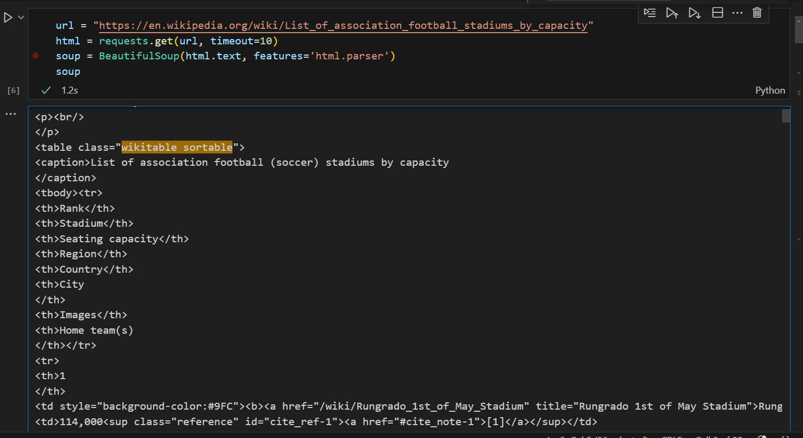

# Football Stadiums Analytics - Data Engineering Project

## Table of Contents
- [Introduction](#introduction)
- [System Architecture](#system-architecture)
- [What You'll Learn](#what-youll-learn)
- [Technologies](#technologies)
- [Walkthrough](#walkthrough)

## Introduction
This project is a data pipeline that extracts, transforms, and loads data from Wikipedia into a PostgreSQL database. The data is about stadiums around the world. Airflow is used to automate the data pipeline. The pipeline is deployed in a Docker environment.

The data is then visualized using Tableau. The visualizations provide insights into the data, such as the most popular stadiums, the largest stadiums, and the stadiums with the most capacity.

## System Architecture


The project is structured with the following components:
- **Data Source**: Tabular data that we crawl from Wikipedia.
- **Airflow**: Automate the data pipeline.
- **PostgreSQL**: Database for storing the data table
- **Tableau**: Visualize the data 

## What You'll Learn
- How to crawl data from websites, like Wikipedia
- Setting data tasks automation using Airflow
- Storing data using PostgreSQL
- Visualizing data using Tableau

## Technologies
- Python
- Airflow
- PostgreSQL
- Tableau

## Walkthrough
1. Download the code and set up Docker environment

- Clone this respository
    ```bash
    git clone https://github.com/hauct/de-football-analytics-.git
    ``` 

- Open your Docker Desktop, build the containers
    ``` bash
    docker compose up -d
    ```

  Make sure these containers are running in your Docker
  
  

2. Run the data pipelines

- Click on port `8080:8080` on Docker Desktop to get access to Airflow Webserver. The username and password are `airflow`

|                                    |                                    |
|------------------------------------|------------------------------------|
|||


- Here, you can see a DAG file `wikipedia_flow`, open it and you will see 4 tasks. Let's take a deeper look on this


* Task `extract_data_from_wikipedia`: The first task is to extract the data from Wikipedia. To do this, we use the requests library to make a GET request to the [Wikipedia football stadium page](https://en.wikipedia.org/wiki/List_of_association_football_stadiums_by_capacity). The response from the request is a HTML document. We then use the BeautifulSoup library to parse the HTML document and extract the table of data.

    The table of data is located in the `<table class="wikitable sortable">` element. We can use the `find_all()` method of the BeautifulSoup object to find the table. Once we have found the table, we can use the find_all() method again to find the rows of data in the table. The rows of data are located in the `<tr>` elements 

    Once we have found the rows, you can use find_all() method to find data, which is in the `<td>` elements.
    After getting the data, you can save the records into dictionary (each record is one dict) and union all. You can check the detailed moves [here](pipelines\wikipedia_pipelines.py)

    |                                                  |                                                  |
    |--------------------------------------------------|--------------------------------------------------|
    |||
    |--------------------------------------------------|--------------------------------------------------|
    |||

* Task `transform_wikipedia_data`: The next task is to pre-process the data. In the original data source, we only know the city and country names of the stadium. To add more data for further analysis, we can use the `geopy` library to determine the stadium's coordinates. In addition, we also perform data cleaning (removing special characters, spaces, etc.) to make the data more suitable for visualization.

    
    
* Task `write_wikipedia_data` and `ingest_wikipedia_data`: After having the tabular table, we will run these two tasks parallelly. The main purpose is storing the data in two types: `csv` file saving in folder `data` and `tabular data` on our Postgre database.

    |                                                  |                                                  |
    |--------------------------------------------------|--------------------------------------------------|
    |||

Now, you can click on button `Run` on the top-right of airflow page. Wait a few minutes until these tasks are all finished (dark green bars are appeared)


**IMPORTANT NOTE**: In order to make sure the data ingested successfully into the database, I added image `pgAdmin` - an open source platform to provide the UI to easily check. 

Click on port `8000:80` on Docker Desktop to open the page. The username and password are `admin@admin.com` and `admin`

|                                    |                                    |
|------------------------------------|------------------------------------|
|||

Here, you can make a connection to your Postgre database, follow these steps below and try querying. Make sure the table is appeared here after the airflow tasks are all successfully run. We will need it to build visualization dashboard

|                                    |                                    |
|------------------------------------|------------------------------------|
|||
|------------------------------------|------------------------------------|
|||


2. Visualization

Open you web browser, get to [Tableau](https://www.tableau.com/products/desktop/download) to download the client. Don't worry about the fee, you just to need to fill some questions to claim 14-days free trial services.

Once you finish registering the license, run Tableau client and go to `Connection`. Choose `PostgreSQL` and fill the hyperparameters of your database to connect to it.


We wil not dive deeply into HOW to build the dashboard to get insights. You may need to research more about the detailed steps. Here are some valuable documents:
 - [Tableau - Tutorial](https://help.tableau.com/current/guides/get-started-tutorial/en-us/get-started-tutorial-home.htm)
 - [Tableau - Youtube](https://www.youtube.com/watch?v=wFCiKvBgiwg)

I built a sample dashboard. Take a look at folder `visual`


And this is the end of my project. Thanks for reading.